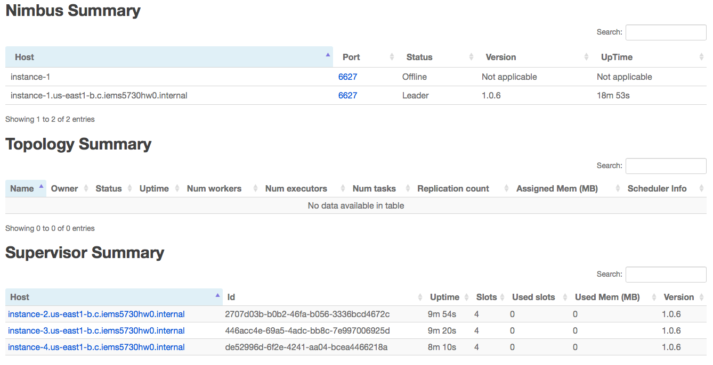
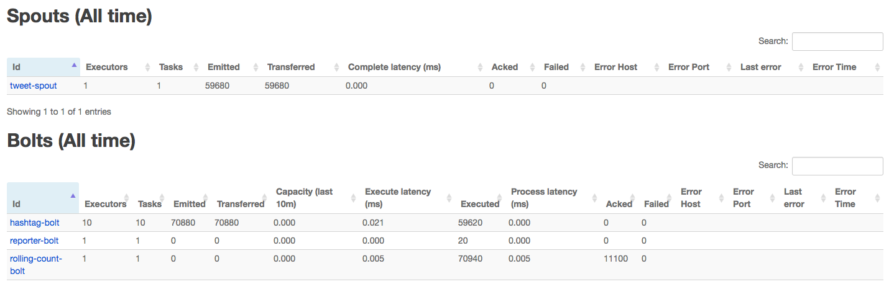

## Q1 Pig Setup and Basic Operations

### a. Install Pig in your cluster.

```bash
cd /home/yongbiaoai/pkgs
wget http://apache.website-solution.net/pig/pig-0.17.0/pig-0.17.0.tar.gz
# extract to /home/yongbiaoai/pkgs/pig-0.17.0
tar -xzf pig-0.17.0.tar.gz

# add following config into .bashrc
export PIG_HOME="/home/yongbiaoai/pkgs/pig-0.17.0"
export PIG_CONF_DIR="$PIG_HOME/conf"
export PIG_CLASSPATH="$PIG_CONF_DIR"
export PATH="$PIG_HOME/bin:$PATH"

source ~/.bashrc
pig -h
# copy pig to other machines
for i in {2,4}; do scp -r ./pig-0.17.0 instance-$i:~/pkgs; done
```

Results:

```text
yongbiaoai@instance-1:~/pkgs$ pig -h

Apache Pig version 0.17.0 (r1797386)
compiled Jun 02 2017, 15:41:58
```

### b. Upload these two files to HDFS and ​join​ them into one table.

Commands:

```bash
wget http://storage.googleapis.com/books/ngrams/books/googlebooks-eng-all-1gram-20120701-a.gz
wget http://storage.googleapis.com/books/ngrams/books/googlebooks-eng-all-1gram-20120701-b.gz

# upload two files into HDFS
gunzip *.gz
hadoop dfs -mkdir hw2
hadoop dfs -copyFromLocal googlebooks-eng-all-1gram-20120701-a hw2/
hadoop dfs -copyFromLocal googlebooks-eng-all-1gram-20120701-b hw2/

# start historyserver
mr-jobhistory-daemon.sh start historyserver

# shell for testing
pig -x local
# shell for provision
pig -x mapreduce
```

Scripts:

```sql
bigram_a = LOAD 'hw2/googlebooks-eng-all-1gram-20120701-a' USING PigStorage('\t') AS (bigram: chararray, year: int, match_count: int, volume_count: int);
bigram_b = LOAD 'hw2/googlebooks-eng-all-1gram-20120701-b' USING PigStorage('\t') AS (bigram: chararray, year: int, match_count: int, volume_count: int);

-- join two table into one
bigram_union = UNION bigram_a, bigram_b;
```

### c. For each unique bigram, compute its average number of occurrences per year.

```sql
-- for each unique bigram, compute its average
bigram_group = GROUP bigram_union BY bigram;
bigram_computed = FOREACH bigram_group GENERATE group AS bigram, AVG($1.$2) AS average;

bigram_sorted = ORDER bigram_computed BY average DESC;
```

### d. Output the 20 bigrams with the highest average number of occurrences per year.

```sql
-- output the 20 bigrams with desc order
bigram_top20 = LIMIT bigram_sorted 20;
STORE bigram_top20 INTO 'hw2/result' USING PigStorage ('\t');
```

**The overall script**:

```sql
-- read two tables from HDFS
bigram_a = LOAD 'hw2/googlebooks-eng-all-1gram-20120701-a' USING PigStorage('\t') AS (bigram: chararray, year: int, match_count: int, volume_count: int);
bigram_b = LOAD 'hw2/googlebooks-eng-all-1gram-20120701-b' USING PigStorage('\t') AS (bigram: chararray, year: int, match_count: int, volume_count: int);

-- join two table into one
bigram_union = UNION bigram_a, bigram_b;

-- for each unique bigram, compute its average
bigram_group = GROUP bigram_union BY bigram;
bigram_computed = FOREACH bigram_group GENERATE group AS bigram, AVG($1.$2) AS average;

bigram_sorted = ORDER bigram_computed BY average DESC;
bigram_top20 = LIMIT bigram_sorted 20;

-- output the 20 bigrams with desc order
STORE bigram_top20 INTO 'hw2/result' USING PigStorage ('\t');
```

Resutls:

```text
HadoopVersion	PigVersion	UserId	StartedAt	FinishedAt	Features
2.9.2	0.17.0	yongbiaoai	2019-02-16 05:38:47	2019-02-16 05:47:36	GROUP_BY,ORDER_BY,LIMIT,UNION

...

Input(s):
Successfully read 86618505 records from: "hdfs://instance-1:9000/user/yongbiaoai/hw2/googlebooks-eng-all-1gram-20120701-a"
Successfully read 61551917 records from: "hdfs://instance-1:9000/user/yongbiaoai/hw2/googlebooks-eng-all-1gram-20120701-b"

Output(s):
Successfully stored 20 records (466 bytes) in: "hdfs://instance-1:9000/user/yongbiaoai/hw2/result"

Counters:
Total records written : 20
Total bytes written : 466
```

**The 20 bigrams with the highest average number of occurrences per year**:

```text
and	2.593207744E7
and_CONJ	2.5906234451764707E7
a	1.6665890811764706E7
a_DET	1.6645121127058823E7
as	6179734.075294117
be	5629591.52
be_VERB	5621156.232941177
as_ADP	5360443.872941176
by	5294067.04
by_ADP	5272951.997647059
are	4298564.341176471
are_VERB	4298561.303529412
at	3676050.1529411767
at_ADP	3670625.785882353
an	2979272.7411764706
an_DET	2977977.8870588234
but	2471102.4964705883
but_CONJ	2468978.0564705883
all	2189962.722352941
all_DET	2161257.294117647
```

## Q2 Hive Setup and Basic Operations

```bash
cd /home/yongbiaoai/pkgs
wget http://apache.01link.hk/hive/hive-2.3.4/apache-hive-2.3.4-bin.tar.gz
tar -xzf apache-hive-2.3.4-bin.tar.gz

# add following into .bashrc
export HIVE_HOME=/home/yongbiaoai/pkgs/apache-hive-2.3.4-bin
export PATH=$HIVE_HOME/bin:$PATH

# init meta schema
schematool -dbType derby -initSchema

# for testing
hive
# for provision
hive -f q2.hql
```

### a. Write a Hive script to perform exactly the same task as that of Q1 with the same datasets.

**Hive script**:

```sql
DROP TABLE IF EXISTS bigram_a;
DROP TABLE IF EXISTS bigram_b;
DROP TABLE IF EXISTS result;

create table bigram_a(bigram STRING, year INT, match_count INT, volume_count INT) ROW FORMAT DELIMITED FIELDS TERMINATED BY '\t' STORED AS TEXTFILE;
create table bigram_b(bigram STRING, year INT, match_count INT, volume_count INT) ROW FORMAT DELIMITED FIELDS TERMINATED BY '\t' STORED AS TEXTFILE;

create table result(bigram STRING, average INT) ROW FORMAT DELIMITED FIELDS TERMINATED BY '\t' STORED AS TEXTFILE;

load data inpath 'hw2/googlebooks-eng-all-1gram-20120701-a' into table bigram_a;
load data inpath 'hw2/googlebooks-eng-all-1gram-20120701-b' into table bigram_b;

insert overwrite table result select bigram, avg(match_count) as average from (select bigram, match_count from bigram_a union all select bigram, match_count from bigram_b) bigram_union group by bigram order by average desc limit 20;
```

Results:

```text
Time taken: 15.999 seconds
OK
Time taken: 0.371 seconds
OK
Time taken: 0.31 seconds
OK
Time taken: 1.22 seconds
OK
Time taken: 0.34 seconds
OK
Time taken: 0.237 seconds
Loading data to table default.bigram_a
OK
Time taken: 1.366 seconds
Loading data to table default.bigram_b
OK
Time taken: 0.744 seconds
...
MapReduce Jobs Launched:
Stage-Stage-1: Map: 12  Reduce: 12   Cumulative CPU: 403.9 sec   HDFS Read: 3070128005 HDFS Write: 90818212 SUCCESS
Stage-Stage-2: Map: 3  Reduce: 1   Cumulative CPU: 29.14 sec   HDFS Read: 90831915 HDFS Write: 345 SUCCESS
Total MapReduce CPU Time Spent: 7 minutes 13 seconds 40 msec
OK
Time taken: 206.91 seconds
```

**The 20 bigrams with the highest average number of occurrences per year**:

```text
and	25932077
and_CONJ	25906234
a	16665890
a_DET	16645121
as	6179734
be	5629591
be_VERB	5621156
as_ADP	5360443
by	5294067
by_ADP	5272951
are	4298564
are_VERB	4298561
at	3676050
at_ADP	3670625
an	2979272
an_DET	2977977
but	2471102
but_CONJ	2468978
all	2189962
all_DET	2161257
```

### b. Rerun the Pig script in this cluster and compare the performance between Pig and Hive in terms of overall run-time and explain your observation.

|Name|Overall Run-Time|
|---|---|
|Pig|589s|
|Hive|228s|

Explains:

Hive script is faster than pig script, since I make some optimizations on the hive script:

1. I only select bigram and match_count from the 2 bigram tables, which is enough for the result computing. In the orgin table, there are 4 columns, since I only query half of them in hive, the time will decrease at least half of it.
2. In the pig script, all the columns will be selected, and will be used in the group operations, which is not necessary but the execute time will increase.
3. The pig script will also save the result into HDFS, which will have extra time overhead compared with hive, as hive only need to save and read results from the local database table.

## Q3 Word Counting on a Storm Cluster

### a. Multi-node Storm cluster setup.

Commands:

```bash
# set up zookeeper
sudo apt-get install zookeeperd
sudo vim /etc/zookeeper/conf/zoo.cfg
sudo start zookeeper

# set up strom
wget http://ftp.cuhk.edu.hk/pub/packages/apache.org/storm/apache-storm-1.0.6/apache-storm-1.0.6.tar.gz
tar -xzf apache-storm-1.0.6.tar.gz

# add following into bashrc
export STORM_HOME=/home/yongbiaoai/pkgs/apache-storm-1.0.6
export PATH=$PATH:$STORM_HOME/bin

# add following into apache-storm-1.0.6/conf/storm.yaml
storm.zookeeper.servers:
    - "instance-1"
nimbus.seeds: ["instance-1"]

# master run
storm nimbus &
storm ui &
storm logviewer &

# copy strom to slaves
for i in {2,3,4}; do scp -r ./apache-storm-1.0.6 instance-$i:~/pkgs; done

# slave run
storm supervisor &
```
Visit Storm UI:



Commands:

```bash
# master run
storm jar examples/storm-starter/storm-starter-topologies-1.0.6.jar storm.starter.StatefulTopology
```

Results:

```text
49752 [main] INFO  o.a.s.s.o.a.z.ZooKeeper - Session: 0x168f5a9b669000c closed
49752 [main-EventThread] INFO  o.a.s.s.o.a.z.ClientCnxn - EventThread shut down
49753 [main] INFO  o.a.s.testing - Shutting down in process zookeeper
49753 [NIOServerCxn.Factory:0.0.0.0/0.0.0.0:2000] INFO  o.a.s.s.o.a.z.s.NIOServerCnxnFactory - NIOServerCnxn factory exited run method
49754 [main] INFO  o.a.s.s.o.a.z.s.ZooKeeperServer - shutting down
49754 [main] INFO  o.a.s.s.o.a.z.s.SessionTrackerImpl - Shutting down
49754 [main] INFO  o.a.s.s.o.a.z.s.PrepRequestProcessor - Shutting down
49754 [ProcessThread(sid:0 cport:-1):] INFO  o.a.s.s.o.a.z.s.PrepRequestProcessor - PrepRequestProcessor exited loop!
49754 [main] INFO  o.a.s.s.o.a.z.s.SyncRequestProcessor - Shutting down
49754 [SyncThread:0] INFO  o.a.s.s.o.a.z.s.SyncRequestProcessor - SyncRequestProcessor exited!
49754 [main] INFO  o.a.s.s.o.a.z.s.FinalRequestProcessor - shutdown of request processor complete
49755 [main] INFO  o.a.s.testing - Done shutting down in process zookeeper
49755 [main] INFO  o.a.s.testing - Deleting temporary path /tmp/947b3cc4-3a85-40e3-8d54-7ca3d55cbc47
49759 [main] INFO  o.a.s.testing - Deleting temporary path /tmp/487ae06c-0093-44d4-a011-67dbb6387392
49759 [main] INFO  o.a.s.testing - Deleting temporary path /tmp/2c11a124-27de-4292-acec-31cbb61d99a0
49760 [main] INFO  o.a.s.testing - Deleting temporary path /tmp/09596540-df29-4a03-b6bd-b66282013c23
50776 [SessionTracker] INFO  o.a.s.s.o.a.z.s.SessionTrackerImpl - SessionTrackerImpl exited loop!
```

### b. Find Frequent Word: At-most-once model

The source code is in hw2/wordcount.

Commands:

```bash
# use github for remote file transfer first
cd /home/yongbiaoai/projects/IEMS5730_HW2
# compile and build jar
mvn compile
mvn clean install

# execute WordCount
mv ./target/hw2-1.0-SNAPSHOT.jar ./
storm jar hw2-1.0-SNAPSHOT.jar wordcount.WordCountTopology WordCount
```

Results:

**Top​ 10 most frequently used words:**

```text
the	80777
and	52754
of	47002
to	25474
I	23545
in	19697
that	18188
And	18141
a	17507
his	13299
```


**Count the number of tuples emitted, number of tuples acked, number of tuples failed in your word counting program:**

|Emitted Tuples Count|Acked Tuples Count|Failed Tuples Count|
|---|---|---|
|1710080|1710080|0|

## Q4 Discover Twitter Trending Hashtags using Storm

The code is in **q3_4**, the twitter module have been heavily refers from the code in **storm/storm-starter** project. The code have declare comments and here is the summary of the reference code name:

|Reference Code|Source Project Name|
|---|---|
|NthLastModifiedTimeTracker.java|storm/storm-starter|
|SlidingWindowCounter.java|storm/storm-starter|
|SlotBasedCounter.java|storm/storm-starter|
|RollingCountBolt.java|storm/storm-starter|
|TweetSpout.java|udacity/ud381|

### a. Find popular hashtags using the multi-node Storm cluster

```bash
# build jar with dependencies
mvn compile
mvn assembly:assembly -DdescriptorId=jar-with-dependencies

# execute HashTag
cp ./target/hw2-1.0-SNAPSHOT-jar-with-dependencies.jar ./
storm jar hw2-1.0-SNAPSHOT-jar-with-dependencies.jar twitter.TwitterHashTagTopology HashTag

# use command to kill app
storm kill HashTag
```

Results:



Example popular hashtag(Running on 2019.02.18):

|HashTag|
|---|
|Trump|
|MarALardass|
|60Minutes|

Core logs:

```text
2019-02-18 02:20:57.085 t.RollingCountBolt Thread-24-rolling-count-bolt-executor[13 13] [INFO] The total tweet in last 600s is=21675
2019-02-18 02:20:57.085 t.RollingCountBolt Thread-24-rolling-count-bolt-executor[13 13] [INFO] Start print report with popular threshold=216.75
2019-02-18 02:20:57.089 t.ReporterBolt Thread-6-reporter-bolt-executor[12 12] [INFO] Popular HashTag:Trump, with frequency:217 in last 600s
2019-02-18 02:20:57.089 t.ReporterBolt Thread-6-reporter-bolt-executor[12 12] [INFO] Popular HashTag:MarALardass, with frequency:640 in last 600s
2019-02-18 02:20:57.089 t.ReporterBolt Thread-6-reporter-bolt-executor[12 12] [INFO] Popular HashTag:60Minutes, with frequency:225 in last 600s
~
```
